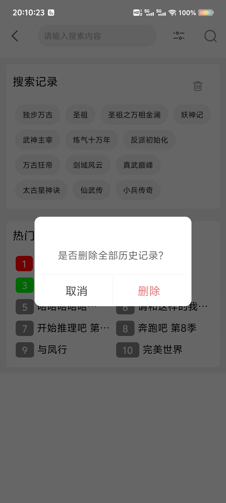
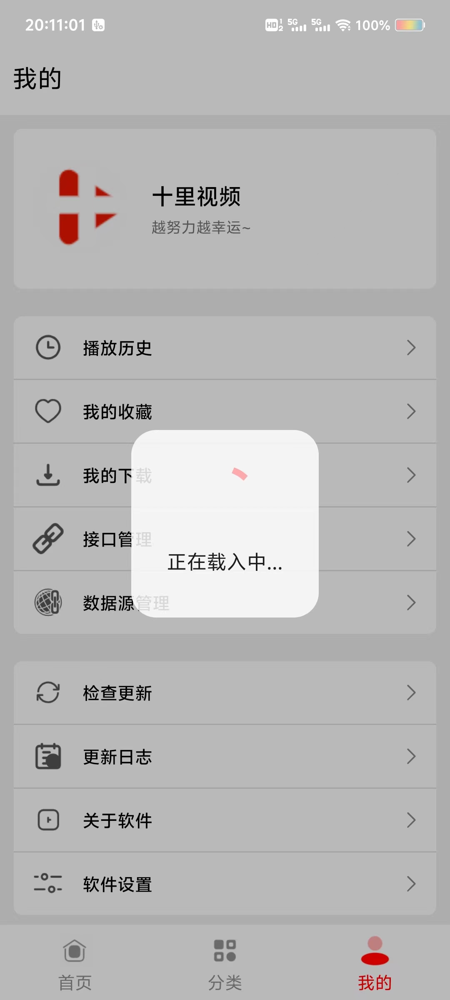
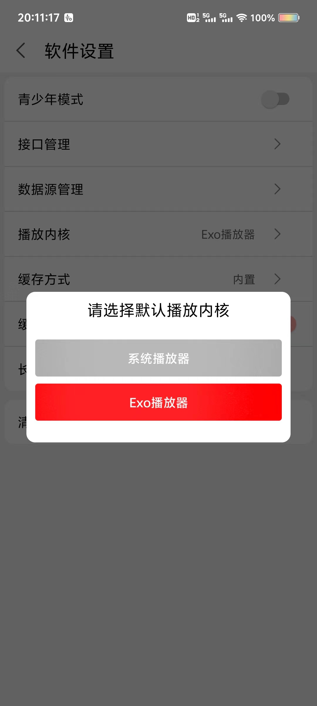
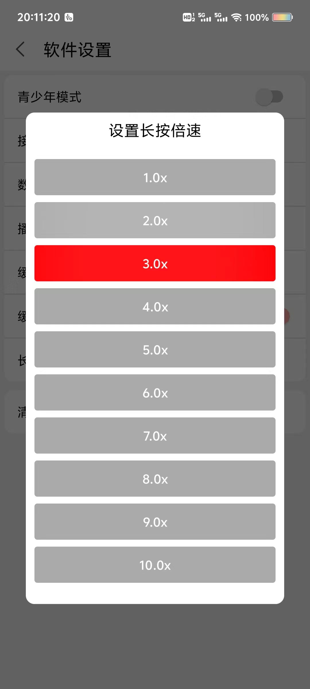

UaoanDialog自定义弹窗


### 集成
 **1.在 project 的 build.gradle 文件中找到 allprojects{} 代码块添加以下代码：** 

```
allprojects {
    repositories {
        mavenCentral()
        maven { url 'https://jitpack.io' }      //增加 jitPack Maven 仓库
    }
}
```
 **在 app 的 build.gradle 文件中找到 dependencies{} 代码块，并在其中加入以下语句：** 

```
implementation 'com.github.uaoan:UaoanDialog:1.0'
```


 **使用代码** 


```


普通弹窗

new UaoanDialog().Dialog(SearchActivity.this)
             .setMessage("是否删除全部历史记录？")
             .setOnNOClickListener("取消", new UaoanDialog.OnNOClickListener() {
                 @Override
                   public void onClick(View v, AlertDialog tc) {
                        tc.dismiss();
                       }
                     })
              .setOnOKClickListener("删除", new UaoanDialog.OnOKClickListener() {
                 @Override
                    public void onClick(View v, AlertDialog tc) {
                       tc.dismiss();
                        }
                        }).show();

加载中弹窗

new UaoanDialog().setLoadingDialog(this, new UaoanDialog.OnLoadingDialog() {
            @Override
            public void onCreate(AlertDialog loading, TextView title) {
                title.setText("加载中...");
            }

            @Override
            public void onKey(DialogInterface dialog, int keyCode, KeyEvent event) {

            }
        });

菜单弹窗

final UaoanDialog uaoanDialog=new UaoanDialog().Dialog(SetUpActivity.this)
                        .setTitle("请选择默认播放内核")
                        .addView(new UaoanDialog.OnViewLayout() {
                            @Override
                            public void onView(View vv, UaoanDialog tc) {
                                MaterialButton button1=new MaterialButton(SetUpActivity.this);
                                MaterialButton button2=new MaterialButton(SetUpActivity.this);
                                button1.setCornerRadius(10);
                                button2.setCornerRadius(10);
                                button1.setText("系统播放器");
                                button2.setText("Exo播放器");
                                tc.addView(button1,50);
                                tc.addView(button2,50);
                                if (mmkv.getMMKVBoolean("播放内核")){
                                    button2.setBackgroundColor(Color.RED);
                                    button1.setBackgroundColor(Color.parseColor("#55000000"));
                                }else {
                                    button1.setBackgroundColor(Color.RED);
                                    button2.setBackgroundColor(Color.parseColor("#55000000"));
                                }
                                button1.setOnClickListener(new View.OnClickListener() {
                                    @Override
                                    public void onClick(View v) {
                                        tc.dismiss();
                                    }
                                });
                                button2.setOnClickListener(new View.OnClickListener() {
                                    @Override
                                    public void onClick(View v) {
                                        tc.dismiss();
                                    }
                                });

                            }
                        }).show();

//菜单弹窗2

new UaoanDialog().Dialog(SetUpActivity.this)
                        .setTitle("设置长按倍速")
                        .addView(new UaoanDialog.OnViewLayout() {
                            @Override
                            public void onView(View vv, UaoanDialog tc) {

                                ArrayList<String> strings=new ArrayList<>();
                                String[] speeds={"1.0x","2.0x","3.0x","4.0x","5.0x","6.0x","7.0x","8.0x","9.0x","10.0x"};
                                int po=0;
                                for (String sp:speeds){
                                    MaterialButton button=new MaterialButton(SetUpActivity.this);
                                    button.setText(sp);
                                    button.setCornerRadius(10);
                                    tc.addView(button,50);
                                    if (mmkv.getMMKVString("speed_text").equals(sp)){
                                        button.setBackgroundColor(Color.RED);
                                    }else {
                                        button.setBackgroundColor(Color.parseColor("#55000000"));
                                    }
                                    int finalPo = po;
                                    button.setOnClickListener(new View.OnClickListener() {
                                        @Override
                                        public void onClick(View v) {
                                            tc.dismiss();
                                        }
                                    });

                                    po++;
                                }

                            }
                        }).show();


```


 
 
 
 


